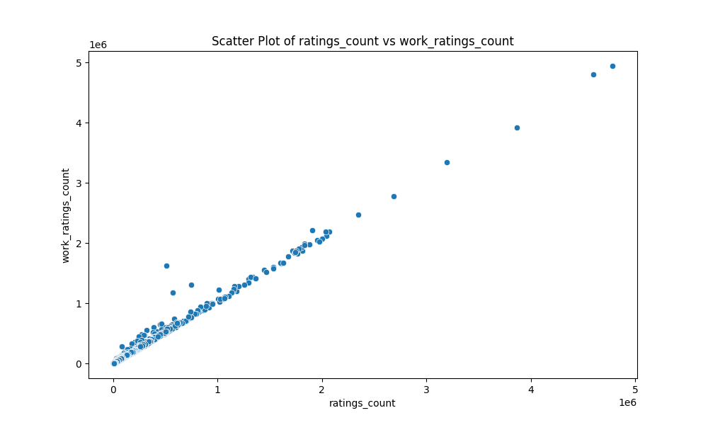

# Analysis Report for `./goodreads`

## Dataset Overview

- **Number of Rows**: 10,000
- **Number of Columns**: 23
- **Columns**:  
  `['book_id', 'goodreads_book_id', 'best_book_id', 'work_id', 'books_count', 'isbn', 'isbn13', 'authors', 'original_publication_year', 'original_title', 'title', 'language_code', 'average_rating', 'ratings_count', 'work_ratings_count', 'work_text_reviews_count', 'ratings_1', 'ratings_2', 'ratings_3', 'ratings_4', 'ratings_5', 'image_url', 'small_image_url']`

### Data Types

| Column Name                     | Column Type |
|----------------------------------|-------------|
| book_id                          | int         |
| goodreads_book_id                | int         |
| best_book_id                     | int         |
| work_id                          | int         |
| books_count                      | int         |
| isbn                             | str         |
| isbn13                           | float       |
| authors                          | str         |
| original_publication_year        | int         |
| original_title                   | str         |
| title                            | str         |
| language_code                    | str         |
| average_rating                   | float       |
| ratings_count                    | int         |
| work_ratings_count               | int         |
| work_text_reviews_count          | int         |
| ratings_1                        | int         |
| ratings_2                        | int         |
| ratings_3                        | int         |
| ratings_4                        | int         |
| ratings_5                        | int         |
| image_url                        | str         |
| small_image_url                  | str         |

## Sample Data

```csv
book_id,goodreads_book_id,best_book_id,work_id,books_count,isbn,isbn13,authors,original_publication_year,original_title,title,language_code,average_rating,ratings_count,work_ratings_count,work_text_reviews_count,ratings_1,ratings_2,ratings_3,ratings_4,ratings_5,image_url,small_image_url
1,2767052,2767052,2792775,272,439023483,9.78043902348e+12,Suzanne Collins,2008.0,The Hunger Games,"The Hunger Games (The Hunger Games, #1)",eng,4.34,4780653,4942365,155254,66715,127936,560092,1481305,2706317,https://images.gr-assets.com/books/1447303603m/2767052.jpg,https://images.gr-assets.com/books/1447303603s/2767052.jpg
2,3,3,4640799,491,439554934,9.78043955493e+12,"J.K. Rowling, Mary GrandPré",1997.0,Harry Potter and the Philosopher's Stone,"Harry Potter and the Sorcerer's Stone (Harry Potter, #1)",eng,4.44,4602479,4800065,75867,75504,101676,455024,1156318,3011543,https://images.gr-assets.com/books/1474154022m/3.jpg,https://images.gr-assets.com/books/1474154022s/3.jpg
3,41865,41865,3212258,226,316015849,9.78031601584e+12,Stephenie Meyer,2005.0,Twilight,"Twilight (Twilight, #1)",en-US,3.57,3866839,3916824,95009,456191,436802,793319,875073,1355439,https://images.gr-assets.com/books/1361039443m/41865.jpg,https://images.gr-assets.com/books/1361039443s/41865.jpg
4,2657,2657,3275794,487,61120081,9.78006112008e+12,Harper Lee,1960.0,To Kill a Mockingbird,To Kill a Mockingbird,eng,4.25,3198671,3340896,72586,60427,117415,446835,1001952,1714267,https://images.gr-assets.com/books/1361975680m/2657.jpg,https://images.gr-assets.com/books/1361975680s/2657.jpg
```

## Key Insights from Analysis

### Basic Analysis

- **Missing Values**:
  | Column Name                       | Missing Count |
  |----------------------------------|----------------|
  | book_id                          | 0              |
  | goodreads_book_id                | 0              |
  | best_book_id                     | 0              |
  | work_id                          | 0              |
  | books_count                      | 0              |
  | isbn                             | 700            |
  | isbn13                           | 585            |
  | authors                          | 0              |
  | original_publication_year        | 21             |
  | original_title                   | 585            |
  | title                            | 0              |
  | language_code                    | 1084           |
  | average_rating                   | 0              |
  | ratings_count                    | 0              |
  | work_ratings_count               | 0              |
  | work_text_reviews_count          | 0              |
  | ratings_1                        | 0              |
  | ratings_2                        | 0              |
  | ratings_3                        | 0              |
  | ratings_4                        | 0              |
  | ratings_5                        | 0              |
  | image_url                        | 0              |
  | small_image_url                  | 0              |

## Preprocessing Insights

### Imputing Missing Values

| Column Name                     | Replace With       | Reasoning                                                                                           |
|----------------------------------|-------------------|----------------------------------------------------------------------------------------------------|
| isbn13                           | mean              | The column is numeric and replacing nulls with mean minimizes impact on overall distribution.       |
| original_publication_year        | mean              | The column is numeric and replacing nulls with mean minimizes impact on overall distribution.       |
| original_title                   | constant value     | Using 'Unknown' helps to identify missing titles.                                                  |
| language_code                    | most frequent      | Replacing with the most frequent value retains commonality of the data.                           |

## Binnable Columns Insights

### Binnable Columns and Reasoning  
| Column Name                     | Is Binnable | Reason                                                                                             |
|----------------------------------|-------------|---------------------------------------------------------------------------------------------------|
| book_id                          | False       | Identifiers should not be binned as they represent unique values.                                  |
| goodreads_book_id                | False       | Identifiers should not be binned as they represent unique values.                                  |
| best_book_id                     | False       | Identifiers should not be binned as they represent unique values.                                  |
| work_id                          | False       | Identifiers should not be binned as they represent unique values.                                  |
| books_count                      | True        | Books count is suitable for binning as it has a sensible range.                                   |
| isbn13                           | False       | Identifiers should not be binned as they represent unique values.                                  |
| original_publication_year        | False       | Does not have a natural binning structure.                                                        |
| average_rating                   | True        | Average ratings are continuous and can be binned.                                                |
| ratings_count                    | True        | Ratings count is suitable for binning due to its range and distribution.                          |
| work_ratings_count               | True        | Work ratings count is suitable for binning due to its range and distribution.                     |
| work_text_reviews_count          | True        | Text reviews count can be binned due to its distribution.                                         |
| ratings_1                        | True        | Counts of ratings (1 star) are discrete and can be binned.                                       |
| ratings_2                        | True        | Counts of ratings (2 stars) are discrete and can be binned.                                       |
| ratings_3                        | True        | Counts of ratings (3 stars) are discrete and can be binned.                                       |
| ratings_4                        | True        | Counts of ratings (4 stars) are discrete and can be binned.                                       |
| ratings_5                        | True        | Counts of ratings (5 stars) are discrete and can be binned.                                       |

## Skewness Category

### Features Segregation on Skewness  
- **Left Skewed**: `['books_count', 'work_ratings_count', 'ratings_count', 'work_text_reviews_count', 'ratings_1', 'ratings_2', 'ratings_3', 'ratings_4', 'ratings_5']`  
- **Right Skewed**: `[]`  
- **Normally Distributed**: `['average_rating']`  

## Visualizations and Insights

  
- **Chart Description**: The chart contains multiple subplots illustrating the distribution of various metrics related to books and their ratings. Metrics include book counts, average ratings, and various rating counts from ratings 1 to 5 displayed as histograms.

- **Analysis**:  
1. The distribution of book counts is skewed low, with fewer books having a higher count. The distribution of average ratings peaks around 4.0, indicating good ratings for many books.
2. Higher ratings (4 and 5) are common, while lower ratings (1 and 2) are infrequent. 


- **Chart Description**: A heatmap displaying correlations between various numerical columns related to books. Each cell reflects the correlation coefficient, with values closer to 1 indicating strong positive correlations.

- **Analysis**:  
1. The highest positive correlation is between 'ratings_5' and 'ratings_count' (0.93).  
2. A strong negative correlation (-0.79) exists between 'ratings_1' and 'ratings_count'.

  
- **Chart Description**: Scatter plot depicting the relationship between 'ratings_count' (x-axis) and 'work_ratings_count' (y-axis).
  
- **Analysis**: A strong positive correlation indicates higher engagement (more ratings) is associated with better quality ratings.  

## Recommendations and Next Steps
- **Data Quality**: Address missing values and outliers for cleaner analysis.
- **Future Exploration**: Use clustering and PCA insights for segmentation and dimensionality reduction.
- **Operational Use**: Leverage time-series patterns for forecasting and geospatial trends for targeted decision-making.

## License
This project is licensed under the MIT License.  
See the [LICENSE](LICENSE) file for details.