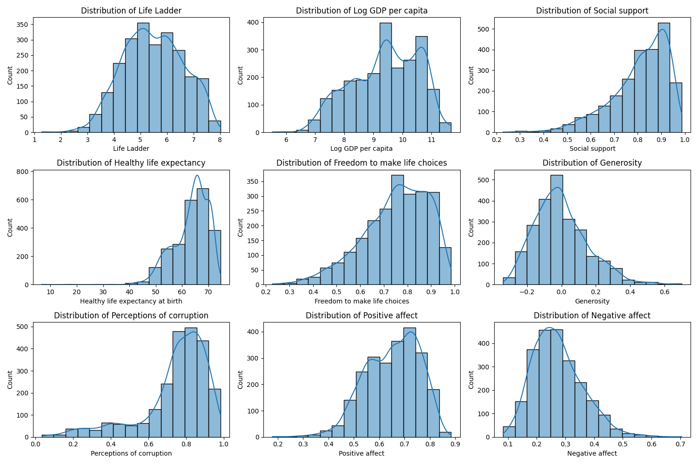

# Analysis Report for `./happiness`

## Dataset Overview
- **Number of Rows**: 2363
- **Number of Columns**: 11
- **Columns**:
  - 'Country name'
  - 'year'
  - 'Life Ladder'
  - 'Log GDP per capita'
  - 'Social support'
  - 'Healthy life expectancy at birth'
  - 'Freedom to make life choices'
  - 'Generosity'
  - 'Perceptions of corruption'
  - 'Positive affect'
  - 'Negative affect'

- **Data Types**:
  - `Country name`: string
  - `year`: integer
  - `Life Ladder`: float
  - `Log GDP per capita`: float
  - `Social support`: float
  - `Healthy life expectancy at birth`: float
  - `Freedom to make life choices`: float
  - `Generosity`: float
  - `Perceptions of corruption`: float
  - `Positive affect`: float
  - `Negative affect`: float

## Sample Data
| Country name | year | Life Ladder | Log GDP per capita | Social support | Healthy life expectancy at birth | Freedom to make life choices | Generosity | Perceptions of corruption | Positive affect | Negative affect |
|---------------|------|-------------|--------------------|----------------|--------------------------------|-------------------------------|------------|-------------------------|----------------|------------------|
| Afghanistan   | 2008 | 3.724       | 7.350               | 0.451          | 50.500                         | 0.718                         | 0.164      | 0.882                   | 0.414          | 0.258            |
| Afghanistan   | 2009 | 4.402       | 7.509               | 0.552          | 50.800                         | 0.679                         | 0.187      | 0.850                   | 0.481          | 0.237            |
| Afghanistan   | 2010 | 4.758       | 7.614               | 0.539          | 51.100                         | 0.600                         | 0.118      | 0.707                   | 0.517          | 0.275            |
| Afghanistan   | 2011 | 3.832       | 7.581               | 0.521          | 51.400                         | 0.496                         | 0.160      | 0.731                   | 0.480          | 0.267            |

## Key Insights from Analysis
### Basic Analysis
- **Missing Values**:
  - {'Country name': 0, 'year': 0, 'Life Ladder': 0, 'Log GDP per capita': 28, 'Social support': 13, 'Healthy life expectancy at birth': 63, 'Freedom to make life choices': 36, 'Generosity': 81, 'Perceptions of corruption': 125, 'Positive affect': 24, 'Negative affect': 16}

## Preprocessing Insights
- **Imputing Missing Values and Reasoning**:
  - `Log GDP per capita`: Mean (Good central measure for normal data)
  - `Social support`: Mean (Good central measure for normal data)
  - `Healthy life expectancy at birth`: Mean (Good central measure for normal data)
  - `Freedom to make life choices`: Mean (Good central measure for normal data)
  - `Generosity`: Mean (Good central measure for normal data)
  - `Perceptions of corruption`: Mean (Good central measure for normal data)
  - `Positive affect`: Mean (Good central measure for normal data)
  - `Negative affect`: Mean (Good central measure for normal data)

## Binnable Columns Insights
- **Binnable Columns and Reasoning**:
  - `year`: Not Binnable (Continuous variable, no distinct categories)
  - `Life Ladder`: Binnable (Range suitable for distinct categories)
  - `Log GDP per capita`: Binnable (Meaningful ranges for categorization)
  - `Social support`: Binnable (Distinct values)
  - `Healthy life expectancy at birth`: Binnable (Categorization possible)
  - `Freedom to make life choices`: Binnable (Meaningful ranges exist)
  - `Generosity`: Binnable (Range of values for categorization)
  - `Perceptions of corruption`: Binnable (Varying levels)
  - `Positive affect`: Binnable (Value ranges can be grouped)
  - `Negative affect`: Binnable (Meaningful grouping possible)

## Skewness Category
- **Features Segregation Based on Skewness**:
  - Left Skewed: ['Generosity', 'Negative affect']
  - Right Skewed: ['Social support', 'Healthy life expectancy', 'Perceptions of corruption', 'Positive affect']
  - Normally Distributed: ['Life Ladder', 'Log GDP per capita', 'Freedom to make life choices']

## Visualizations and Insights

- **Chart Description**: The chart displays a 3x3 grid of histograms representing the distributions of various social and economic factors. Metrics analyzed include Life Ladder, Log GDP per capita, Social support, Healthy life expectancy, Freedom to make life choices, Generosity, Perceptions of corruption, Positive affect, and Negative affect.
- **LLM Analysis**:
  1. **Life Ladder**: Slight right skew indicates higher well-being.
  2. **Log GDP per capita**: Right skew; higher GDP outliers exist.
  3. **Social Support**: Slight positive skew suggests well-supported individuals.
  4. **Healthy Life Expectancy**: Unimodal with slight right skew.
  5. **Freedom to Make Life Choices**: Right skew with high freedom reported.
  6. **Generosity**: Uniform yet skewed distribution.
  7. **Perceptions of Corruption**: Bimodal with division in views.
  8. **Positive Affect**: Left skew indicates moderate positive emotions.
  9. **Negative Affect**: Low overall negative affect reported.

- **Chart Description**: The correlation matrix illustrates relationships between social and economic factors.
- **LLM Analysis**:
  1. **Strongest Relationship**: Between 'Make life choices' and 'Life ladder' (0.81).
  2. **Positive Influences**: 'GDP per capita' positively correlated with 'Life ladder' (0.77).
  3. **Negative Associations**: 'Corruption' negatively correlated with 'Life ladder' (-0.46).
  4. **Moderate Correlations**: Observed with 'Generosity', 'Positive affect', and 'Social support'.

- **Chart Description**: This scatter plot represents the relationship between Log GDP per capita and healthy life expectancy at birth. 
- **LLM Analysis**:
  1. **Positive Correlation**: Suggests higher GDP leads to better health outcomes.
  2. **Variability**: Notable variability at similar GDP levels.
  3. **Outliers**: Some countries exhibit unusual health outcomes in relation to GDP.

### Outlier Summary:
- **Year**: 0 Outliers detected
- **Life Ladder**: 2 Outliers detected
- **Log GDP per capita**: 1 Outliers detected
- **Social Support**: 48 Outliers detected
- **Healthy Life Expectancy**: 27 Outliers detected
- **Freedom to Make Life Choices**: 16 Outliers detected
- **Generosity**: 44 Outliers detected
- **Perceptions of Corruption**: 225 Outliers detected
- **Positive Affect**: 9 Outliers detected
- **Negative Affect**: 31 Outliers detected

## Recommendations and Next Steps
- **Data Quality**: Address missing values and outliers for cleaner analysis.
- **Future Exploration**: Utilize clustering and PCA for segmentation and dimensionality reduction.
- **Operational Use**: Leverage time-series patterns for forecasting and geospatial trends for targeted decision-making.

## License
This project is licensed under the MIT License. See the [LICENSE](LICENSE) file for details.