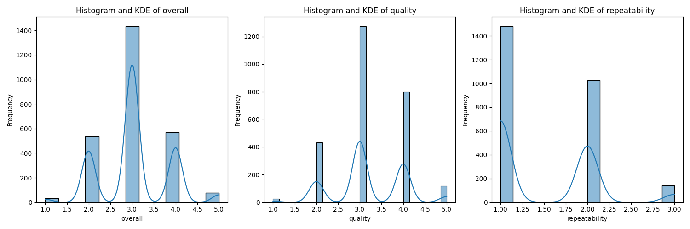
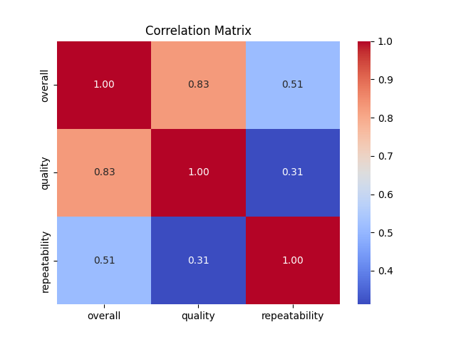
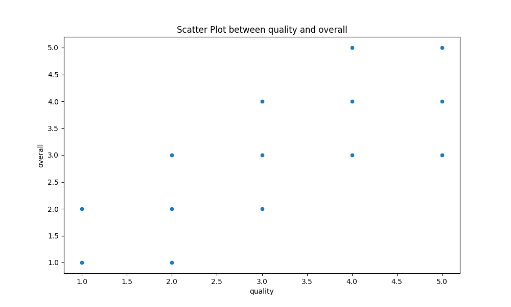

# Analysis Report for `./media`

## Dataset Overview
- **Number of Rows**: 2652  
- **Number of Columns**: 8  
- **Columns**:  
  - `date`  
  - `language`  
  - `type`  
  - `title`  
  - `by`  
  - `overall`  
  - `quality`  
  - `repeatability`   

- **Data Types**:  
  | Column Name | Data Type  |
  |-------------|------------|
  | date       | datetime   |
  | language   | string     |
  | type       | string     |
  | title      | string     |
  | by         | string     |
  | overall    | integer    |
  | quality    | integer    |
  | repeatability| integer  |

## Sample Data
| date        | language | type  | title                      | by                                             | overall | quality | repeatability |
|-------------|----------|-------|---------------------------|-----------------------------------------------|---------|---------|----------------|
| 15-Nov-24   | Tamil    | movie | Meiyazhagan               | Arvind Swamy, Karthi                          | 4       | 5       | 1              |
| 10-Nov-24   | Tamil    | movie | Vettaiyan                 | Rajnikanth, Fahad Fazil                       | 2       | 2       | 1              |
| 09-Nov-24   | Tamil    | movie | Amaran                    | Siva Karthikeyan, Sai Pallavi                 | 4       | 4       | 1              |
| 11-Oct-24   | Telugu   | movie | Kushi                     | Vijay Devarakonda, Samantha                  | 3       | 3       | 1              |

## Key Insights from Analysis
### Basic Analysis  
- **Missing Values**:  
  | Column Name | Missing Values |
  |-------------|----------------|
  | date       | 99             |
  | language   | 0              |
  | type       | 0              |
  | title      | 0              |
  | by         | 262            |
  | overall    | 0              |
  | quality    | 0              |
  | repeatability| 0            |

## Preprocessing Insights  
- **Imputing Missing Values and Reasoning**:  
  | Column Name | Replace With      | Reasoning                                                               |
  |-------------|--------------------|-------------------------------------------------------------------------
  | date       | mean               | The 'date' column is numerical and replacing null values with the mean is appropriate to maintain the central tendency.  |
  | by         | most frequent      | The 'by' column is categorical and replacing null values with the most frequent value (mode) preserves the representation of the common categories.   |

## Binnable Columns Insights  
- **Binnable Columns and Reasoning**:  
  | Column Name  | Binnable | Reasoning                                                      |
  |--------------|----------|---------------------------------------------------------------|
  | overall      | Yes      | The column has a finite range and can be grouped into bins effectively.  |
  | quality      | Yes      | The column has a finite range and can be grouped into bins effectively.  |
  | repeatability | Yes      | The column has a finite range and can be grouped into bins effectively.  |

## Skewness Category  
- **Features Segregation on Skewness**:  
  - **Left Skewed**: None  
  - **Right Skewed**: overall, quality, repeatability   
  - **Normally Distributed**: None  

## Visualizations and Insights  

- **Chart Description**:  
  The chart includes three histograms and KDE plots representing 'overall', 'quality', and 'repeatability' variables. The KDE curves assist in visualizing the data distribution across these variables.  

- **Insights from Chart**:  
  1. **Overall Distribution**: Displays a bimodal distribution with peaks around 1.5 and 4.0, suggesting two distinct groups.  
  2. **Quality Distribution**: Also exhibits a bimodal distribution with peaks at around 2.0 and 4.0, indicating varied quality ratings.  
  3. **Repeatability Distribution**: Shows a smooth and more uniform distribution, suggesting less variability in repeatability ratings.  

- **Chart Description**:  
  This is a correlation matrix displaying the relationships between overall, quality, and repeatability variables, indicating correlation strength via color coding.  

- **Insights from Correlation Matrix**:  
  1. Strong positive correlation (0.83) between 'overall' and 'quality'.  
  2. Weak correlation (0.31) between 'quality' and 'repeatability'.  
  3. Moderate correlation (0.51) between 'overall' and 'repeatability'.  

- **Chart Description**:  
  This scatter plot shows the relationship between 'quality' and 'overall' ratings. Each point represents a pairing of these two variables.  

- **Insights from Scatter Plot**:  
  Positive correlation observed—higher quality ratings lead to higher overall ratings.  

- **Outliers Detected**:  
  - Column `overall`: 1216 outliers detected (Range: 3.0 to 3.0)  
  - Column `quality`: 24 outliers detected (Range: 1.5 to 5.5)  
  - Column `repeatability`: 0 outliers detected (Range: -0.5 to 3.5)  

## Recommendations and Next Steps  
- **Data Quality**: Address missing values and outliers for cleaner analysis.  
- **Future Exploration**: Use clustering and PCA for further segmentation and dimensionality reduction insights.  
- **Operational Use**: Leverage time-series patterns for forecasting and geospatial trends for effective decision-making.

## License
This project is licensed under the MIT License.